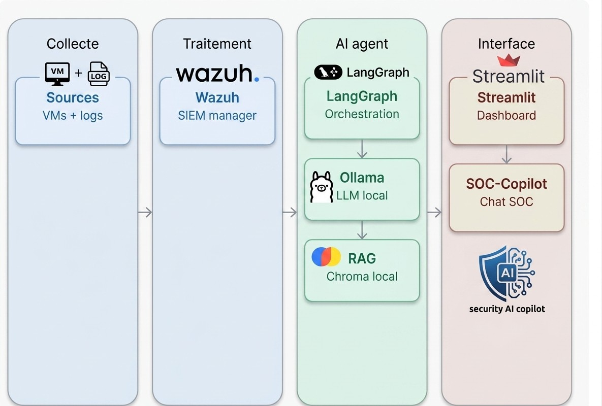

# SOC Lab - Intelligence Artificielle pour le Triage d'Alertes Wazuh

[](https://www.python.org/)
[](https://wazuh.com/)
[](https://github.com/langchain-ai/langgraph)

**Un agent IA pour automatiser le triage et l'enrichissement contextuel des alertes de sécurité Wazuh.**

---

## 🎯 Objectif

Ce projet déploie un **Security Operations Center (SOC) complet** incluant :
- ✅ Déploiement d'une infrastructure **Wazuh** (SIEM open-source)
- ✅ Extension au niveau réseau (syslog OPNsense)
- ✅ Agent IA de **triage automatique** des alertes avec enrichissement MITRE ATT&CK
- ✅ **Dashboard interactif** pour consultation et analyse
- ✅ **Assistant conversationnel** (SOC Copilot) pour interrogations libres

---

## 🏗️ Architecture



### Composants

| Couche | Composant | Rôle |
|--------|-----------|------|
| **Collecte** | Wazuh Manager + Agents | Collecte des logs VMs et endpoints |
| **Traitement** | Wazuh SIEM | Centralisation, indexation, règles |
| **IA** | LangGraph + Ollama + RAG Chroma | Triage automatique, enrichissement MITRE |
| **Interface** | Streamlit Dashboard | Affichage et interaction analyste |

---

## 🚀 Démarrage Rapide

### Prérequis

- Docker & Docker Compose (recommandé) OU Python 3.9+
- Wazuh 4.14+ (déployé et opérationnel)
- Ollama (pour le modèle LLM local llama3.2:3b)
- 8GB RAM minimum, 20GB disque libre

### Installation

#### Option 1 : Avec Docker Compose (recommandé)

```bash
git clone https://github.com/yourusername/soc-lab-ia.git
cd soc-lab-ia
docker-compose up -d
```

Accès : http://localhost:8501

#### Option 2 : Installation manuelle

```bash
# 1. Cloner le repo
git clone https://github.com/yourusername/soc-lab-ia.git
cd soc-lab-ia

# 2. Créer environnement Python
python3 -m venv venv
source venv/bin/activate  # Windows: venv\Scripts\activate

# 3. Installer les dépendances
pip install -r requirements.txt

# 4. Configurer les paramètres
cp .env.example .env
# Éditer .env avec vos paramètres Wazuh/Ollama

# 5. Initialiser la base MITRE ATT&CK
python3 scripts/extraire_mitre.py

# 6. Démarrer l'agent graph (backend)
python3 agent_graph.py &

# 7. Démarrer le dashboard Streamlit
streamlit run dashboard.py
```

---

## 📁 Structure du Projet

```
soc-lab-ia/
├── README.md                          # Ce fichier
├── architecture.jpg                   # Schéma d'architecture
├── requirements.txt                   # Dépendances Python
├── .env.example                       # Template variables d'env
├── .gitignore                         # Fichiers à ignorer
│
├── agent_graph.py                     # Pipeline LangGraph (orchestration)
├── pages/
│   └── 1_Chat_SOC_Copilot.py         # Page chat conversationnel
│
├── dashboard.py                       # Dashboard Streamlit principal
│
├── scripts/
│   ├── extraire_mitre.py              # Extraction corpus MITRE ATT&CK
│   ├── indexer_mitre_chroma.py        # Indexation vectorielle (Chroma)
│   └── ground_truth.py                # Jeu de vérité pour évaluation
│
├── docs/
│   ├── INSTALLATION.md                # Guide d'installation détaillé
│   ├── API.md                         # Documentation API Wazuh
│   ├── PROMPT_ENGINEERING.md          # Techniques de prompting utilisées
│   └── ARCHITECTURE.md                # Architecture technique complète
│
└── docker-compose.yml                 # Composition services (optional)
```

---

## 🔄 Flux d'Exécution

### Triage Automatique (Pipeline LangGraph)

```
Alerte Wazuh
    ↓
[1] Récupération via API indexer
    ↓
[2] Contexte MITRE (lookup exact → RAG sémantique)
    ↓
[3] Calcul priorité (déterministe)
    ↓
[4] Génération analyse (LLM Ollama)
    ↓
[5] Validation JSON + Retry automatique
    ↓
Output: { urgence, résumé, contexte_mitre, recommandation }
```

### Chat Conversationnel (RAG)

```
Question Analyste
    ↓
Recherche sémantique Chroma (corpus MITRE)
    ↓
Injection contexte + historique conversation
    ↓
Génération LLM en texte libre
    ↓
Réponse opérationnelle
```

---

## 🎨 Fonctionnalités Clés

### 1️⃣ Agent IA de Triage

- **Lookup exact** : Si Wazuh a déjà mappé à un ID MITRE natif
- **RAG sémantique** : Recherche vectorielle sur corpus MITRE (709 techniques)
- **Priorité calculée** : Basée sur sévérité Wazuh (Faible/Moyenne/Élevée)
- **Retry automatique** : Génération JSON fiable via LangGraph
- **Recommandations opérationnelles** : Actions immédiates pour chaque alerte

### 2️⃣ Dashboard Streamlit

- Affichage alertes récentes (20 dernières)
- Indicateurs sévérité (couleurs + chiffres)
- Bouton "Analyser" par alerte → résultat instantané
- Historique d'analyses en session

### 3️⃣ SOC Copilot (Chat)

- Questions libres sur techniques MITRE
- Distinctions fines (T1110 vs T1110.001, etc.)
- Questions opérationnelles ("que faire face à cette alerte ?")
- Historique conversation limité (6 derniers échanges)

---

## ⚙️ Configuration

### Fichier `.env`

```bash
# Wazuh Indexer (OpenSearch)
INDEXER_HOST=https://192.168.10.135:9200
INDEXER_USER=admin
INDEXER_PASSWORD=admin

# Wazuh API Management
WAZUH_API_HOST=https://192.168.10.135:55000
WAZUH_API_USER=wazuh
WAZUH_API_PASSWORD=wazuh

# Ollama (LLM local)
OLLAMA_HOST=http://localhost:11434
OLLAMA_MODEL=llama3.2:3b

# Chroma (Vector DB)
CHROMA_PATH=./chroma_mitre

# LangGraph
MAX_RETRIES=2
```

---

## 📊 Résultats d'Évaluation

### RAG MITRE ATT&CK

- **Précision@3** : 80% (8/10 couples description-technique identifiés correctement)
- **Métrique** : Similarité cosinus (L2 euclidienne inadaptée aux embeddings nomic)
- **Corpus** : 709 techniques extraites depuis MITRE Enterprise

### Triage d'Alertes

Corpus de test couvrant :
- ✅ Force brute SSH (T1110.001 / T1021.004)
- ✅ Abus sudo (T1548.003)
- ✅ Gestion comptes (T1136 / T1098)
- ✅ Élévation privilèges (T1548.003 / T1078)
- ✅ Attaque Hydra (T1110.001 / T1021.004)
- ✅ Intégrité fichiers (T1565.001)

---

## 🧪 Tests & Validation

### Générer des alertes de test

Utiliser **Atomic Red Team** pour des tests reproduisibles mappés à MITRE :

```bash
# Installation PowerShell
IEX (IWR "https://raw.githubusercontent.com/redcanaryco/invoke-atomicredteam/master/install-atomicredteam.ps1" -UseBasicParsing)
Install-AtomicRedTeam -getAtomics

# Lancer un test (ex. T1548.003 - Sudo usage)
Invoke-AtomicTest T1548.003 -TestNumbers 1
```

### Évaluer le RAG

```bash
python3 scripts/evaluer_precision.py
# → Precision@3 : 80% (8/10)
```

---

## 🔒 Sécurité

⚠️ **Important pour la production** :

1. **Identifiants** : Remplacer admin/admin par comptes dédiés à privilèges restreints
2. **HTTPS** : Valider certificats SSL/TLS (auto-signés en lab uniquement)
3. **API Keys** : Stocker dans `.env` (jamais en clair dans le code)
4. **Logs** : Audit des analyses IA (recommandations et actions)
5. **Isolation réseau** : Ollama/Chroma ne doivent pas être exposés publiquement

---

## 📚 Documentation Complète

- [INSTALLATION.md](docs/INSTALLATION.md) — Guide étape par étape
- [ARCHITECTURE.md](docs/ARCHITECTURE.md) — Détails techniques
- [API.md](docs/API.md) — Endpoints Wazuh utilisés
- [PROMPT_ENGINEERING.md](docs/PROMPT_ENGINEERING.md) — Technique de prompting
- [RAPPORT_STAGE.pdf](docs/RAPPORT_STAGE.pdf) — Rapport d'étape complet

---

## 🤝 Contribution

Les contributions sont bienvenues ! Consultez [CONTRIBUTING.md](CONTRIBUTING.md) pour les guidelines.

---

## 📝 Licence

MIT License — Voir [LICENSE](LICENSE)

---

## 👥 Auteur

**Elmaataoui Ihssane**  
 — Cybersecurity & Cloud Computing  
ENSAM Casablanca | Juillet 2026

---

